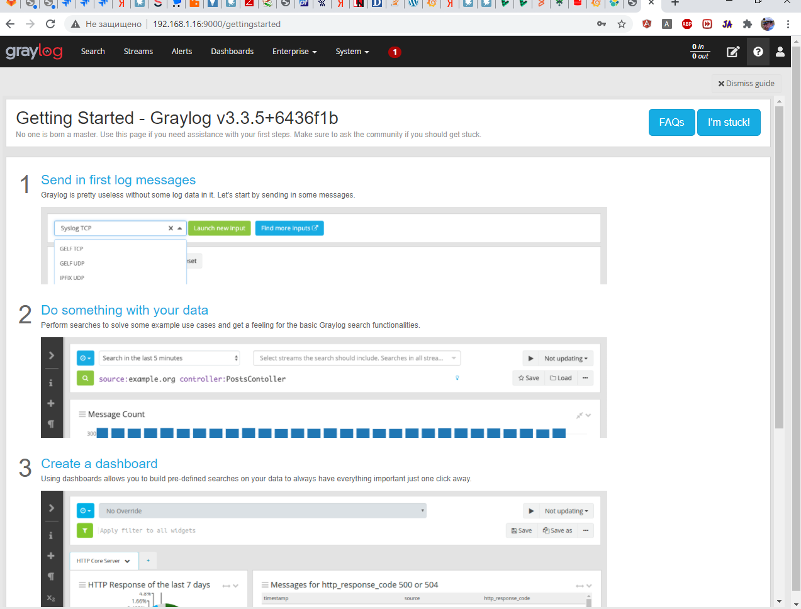

# otus-lab-6
# Установка Graylog2, сбор логов

Установку выполняем в виртуальной машине под управлением Centos 7.    
Всё делаем от имени суперпользвателя или используя механизм sudo.
  
Так как ставить будем на чистую минимальную установку, сначала устанавливаем java
```bash
yum install -y java
```
Копируем файл [mongo-org.repo](templates%2Fmongo-org.repo) в папку /etc/yum.repos.d

Устанавливаем mongo.

```bash
yum install mongodb-org
```
Запускаем сервис 

```bash
systemctl daemon-reload
systemctl enable mongod.service
systemctl start mongod.service
```
Проверяем установку и убеждаемся что демон базы данных стартовал.
```bash
systemctl --type=service --state=active | grep mongod
```

Устанавливаем ключ elasticksearch
```bash
rpm --import https://artifacts.elastic.co/GPG-KEY-elasticsearch
```
Копируем файл [elasticsearch.repo](templates%2Felasticsearch.repo) в /etc/yum.repos.d/

Устанавливаем elasticsearch
```bash
yum install -y elasticsearch-oss
```

Редактируем /etc/elasticsearch/elasticsearch.yml под наши цели.
Запускаем сервис.
```bash
systemctl daemon-reload
systemctl enable elasticsearch.service
systemctl restart elasticsearch.service
```
Проверяем установку.
```bash
systemctl --type=service --state=active | grep elasticsearch
```

Устанавливаем репозиторий graylog. 
```bash
rpm -Uvh https://packages.graylog2.org/repo/packages/graylog-3.3-repository_latest.rpm
```

Устанавливаем graylog

```bash
yum install -y graylog-server
```

Разрешае автозапуск 
```bash
systemctl enable graylog-server
```

Генерируе пароль для graylog.
```bash
echo -n "Enter Password: " && head -1 </dev/stdin | tr -d '\n' | sha256sum | cut -d" " -f1
```
Вписываем пароль в файл настроек /etc/graylog/server/server.conf


Запускаем ....
```bash
systemctl start graylog-server
```
Разрешаем доступ к graylog по http протоколу с других узлов.
```typescript
firewall-cmd --zone=public --add-port=9000/tcp --permanent
firewall-cmd --reload
```

В браузере переходим по ссылке graylog:9000  и проверяем установку.


Вводим имя admin и пароль, использованный при генерации. 

Graylog установлен успешно и можно настроить поток логов в него.

Разрешим доступ к порту через который будем слать информацию
```typescript
firewall-cmd --zone=public --add-port=12201/tcp --permanent
firewall-cmd --reload
```
Можно настроить system/input для получения логов.

